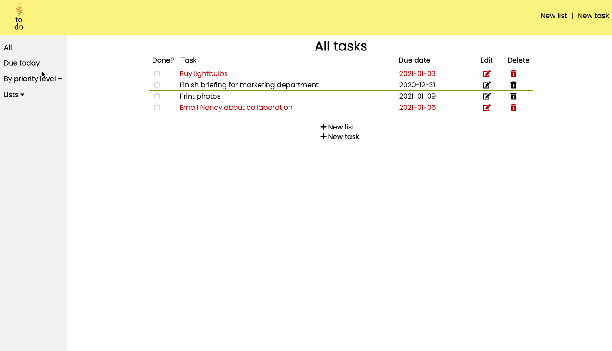

# To do list

## Summary
Simple to do list app, developed as part of The Odin Project's [Ruby on Rails Curriculum](http://www.theodinproject.com).

## Technology
Built using JavaScript, SCSS and barebones HTML. Also includes Flaggrid, a grid-based CSS template I created for small projects. 

## The goods
The app can be viewed [here](https://naomiflagg.github.io/to-do-list/.).

## Demo

